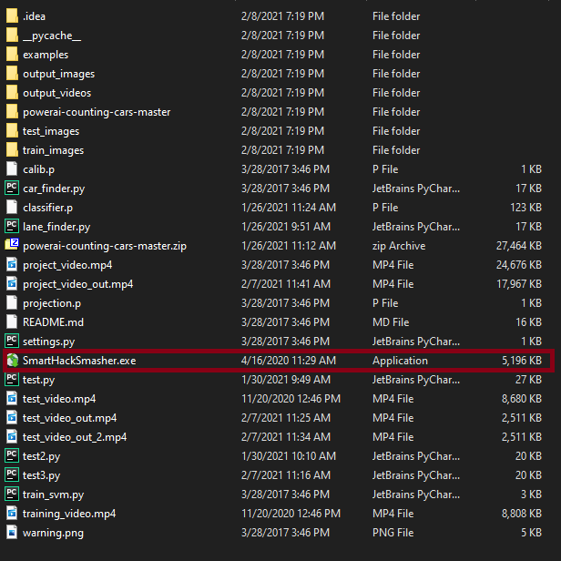
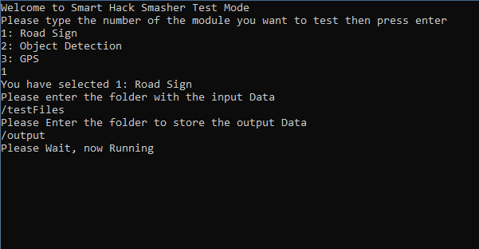
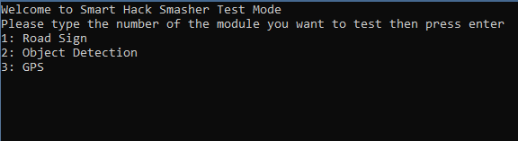

# User Guide

### Getting Started

* **What is SmartHackSmasher?**
  * An oversight program to keep cars safe
    * Detect anomalies as they happen 
      * Hackers may interfere with systems and feed bad data
      * All Computers have glitches occasionally and detecting these can be critical
    * Intervene when anomalies are detected and attempt to bring car back into a safe operating mode
  * SmartHackSmasher monitors a variety of inputs
    * Current Design includes (https://github.com/achyut3598/SmartHackSmasher/tree/master/Design_Diagrams)
      * Road Signs
      * Object Detection
      * GPS Data
    * Can be expanded to include every type of input a car has.
* **What isn’t SmartHackSmasher**?
  * Stand-alone driverless car software
    * SmartHackSmasher merely functions as a part of a whole system
    * It only interacts with the car’s main function when something goes wrong
* **Installing SmartHackSmasher (Standalone Test Mode)**
  * SmartHackSmasher comes packaged in a zip file.
  * After extracting this zip file, there will be an exe inside the extracted folder called SmartHackSmasher.exe
  
  * Run this executable in administrator Mode
  * This will open up a command menu and you are good to skip to the *Basics* section below
* **Installing SmartHackSmasher (Deployment Inside car Mode)**
  * Since different cars have different operating systems, one can grab the binary files from https://github.com/achyut3598/SmartHackSmasher once they are posted and compile the files in the required format and deploy SmartHackSmasher in their cars

### Basics

* Running Standalone Test Mode
  * After Running SmartHackSmasher.exe you will be presented with the below Program
    
  * Choose a selection from one of the available modules by following the instructions and you will then be prompted for the input files
  * These input files are what SmartHackSmasher will scan for anomalies
  * After Submitted the input file folder, you will then be prompted for an output folder
  * After submitting the output folder, the program will now look like the below
    
  * The program will close when it is complete
  * The output Folder will now contain a text file titled results.txt
  * This text file will be formatted as below
    * Image1: Good
    * Image2: Good
    * Image3: Good
    * Image4: Anomaly
    * Image5: Good

### FAQ

**Do I need to use all three modules in order to use SmartHackSmasher?**

No. SmartHackSmasher can work with one to two modules excluded, but will provide less accurate determinations about the data as a whole because it will have less information to work with

**Will SmartHackSmasher work with this car?**

Yes. SmartHackSmasher is designed independent of individual cars, and as such should fit any car.

**Has SmartHackSmasher been tested on a real self driving car?**

No. SmartHackSmasher was designed as a heavily budgeted research project that did not have access to that technology. It should not be used on the road without further testing.

**Will SmartHackSmasher protect my data?**

No. SmartHackSmasher is meant to combat against faulty datastreams, but does not encrypt your data in any way when it does analysis. Any encryption will need to be done by a car’s developer.

**Who made SmartHackSmasher?**

SmartHackSmasher was made as a senior design project for the University of Cincinnati. You can find more information about its developers here: https://github.com/achyut3598/SmartHackSmasher/wiki/Professional-Biographies

**What if I want to learn more?**

The SmartHackSmasher wiki can be found here: https://github.com/achyut3598/SmartHackSmasher/wiki

**What if I want to see how it works?**

There will be a simulation posted here soon: [https://github.com/achyut3598/SmartHackSmasher/](https://github.com/achyut3598/SmartHackSmasher/wiki)